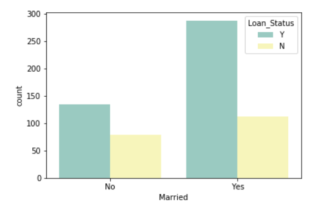
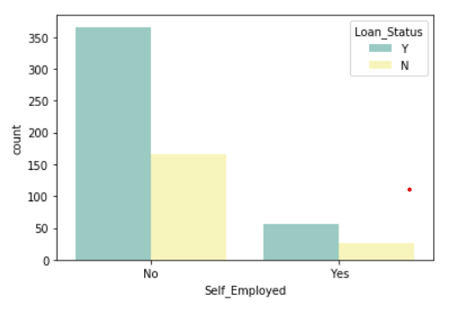
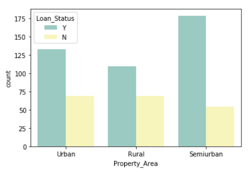
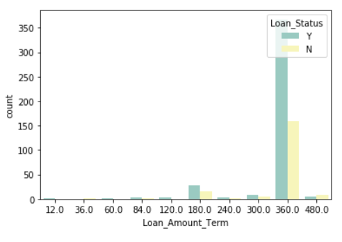
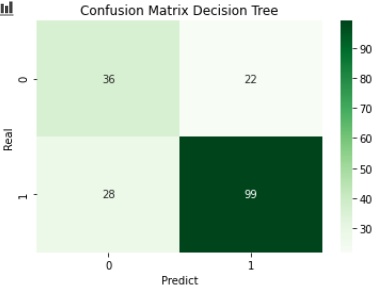
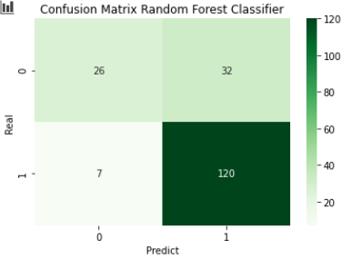

# Loan Prediction

### _The Problem_
Dream Housing Finance is a home loan company. The company wants to automate the loan process by filling out an online form for the customer.

In this form the client must inform the following data: Sex, Marital Status, Education, Number of Dependents, Income, Loan Amount, Credit History and others.

It is a classification problem as it will be foreseen whether the loan will be accepted or not.

The data was taken from Kaggle. Follow the link:
https://www.kaggle.com/burak3ergun/loan-data-set?select=loan_data_set.csv

### _Exploratory Data Analysis_

Having a visual summary of the information makes it easier to identify patterns and trends than to look at the lines of a spreadsheet. For that I used seaborn which is a Python data visualization library based on matplotlib.

|  |  | |
|:-:|:-:|:-:|
|  |  | |

Through the graphics we can verify:
- The predominance of loan applications by men, as well as the largest number of loans for this gender;
- Virtually twice as many loan applications by married people and twice as many loan approvals for this category;
- The prevalence of requests by non-self-employed people and the approval of loans for this category;
- Predominance of loan applications and approvals by people with a good credit history;
- Slightly higher loan approval and requests for the semi-urban population than for the urban population;
- Prevalence of loan approval for credits and high period of time;
### _Transforming categorical variables into numeric ones_
To work with machine learning we need to transform categorical variables into numeric ones. For this I used the pandas get_dummies method.

### _Algorithms Used_
For this classification problem I used the following algorithms: Logistic Regression, Decision Tree and Random Forest.

### _Performance Metrics_
I chose to use the F1_Score metric which is a harmonic average of the precision and recall metrics. I did not choose to use accuracy because for unbalanced data sets it is not advisable. It can be seen that Logistic Regression performed slightly better than Random Forest Classifier and the worst performance of the three algorithms was with Decision Tree.

Finally, I applied the Confusion Matrix, which is a great tool to assess behavior and understand the effectiveness of a binary or categorical classifier.

The Confusion Matrix is a two-dimensional matrix that compares the predicted category labels with the actual labels.

|  |  | |
|:-:|:-:|:-:|

Through the Confusion Matrix it can be seen that the performance of the Logistic Regression and Random Forest Classifier was practically the same and a worse performance in the classification through the Decision Tree.

